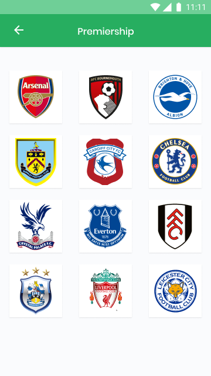

## Android Engineer Test

Objective of this test is to know the ability of the applicant in key android development requirement. We are looking to measure performance based on Clean Code, Architecture pattern, Unit testing, speed and using of popular android libraries.

You are to write a simple android  with 3 screens.
Get sport data from https://www.football-data.org/, 
persist locally some  part of it locally, display data on screen.

You would have to register and get an api key from https://www.football-data.org/ before you can call their apis.

### Instructions

You are to get all competitions, persist them using an ORM database of your choice (Room, SqlDelight etc) and display them on the screen 1 below

When a competition is clicked, a new screen is opened which shows all the teams involved in the competition.

And when a team is clicked, another screen is opened which shows the team details and players in squad.

We prefer the following technologies to be used:  
Language: Kotlin 
Concurrency: Coroutines 
Database: Any ORM library you're comfortable with 
Architecture: MVVM, MVP or MVI

